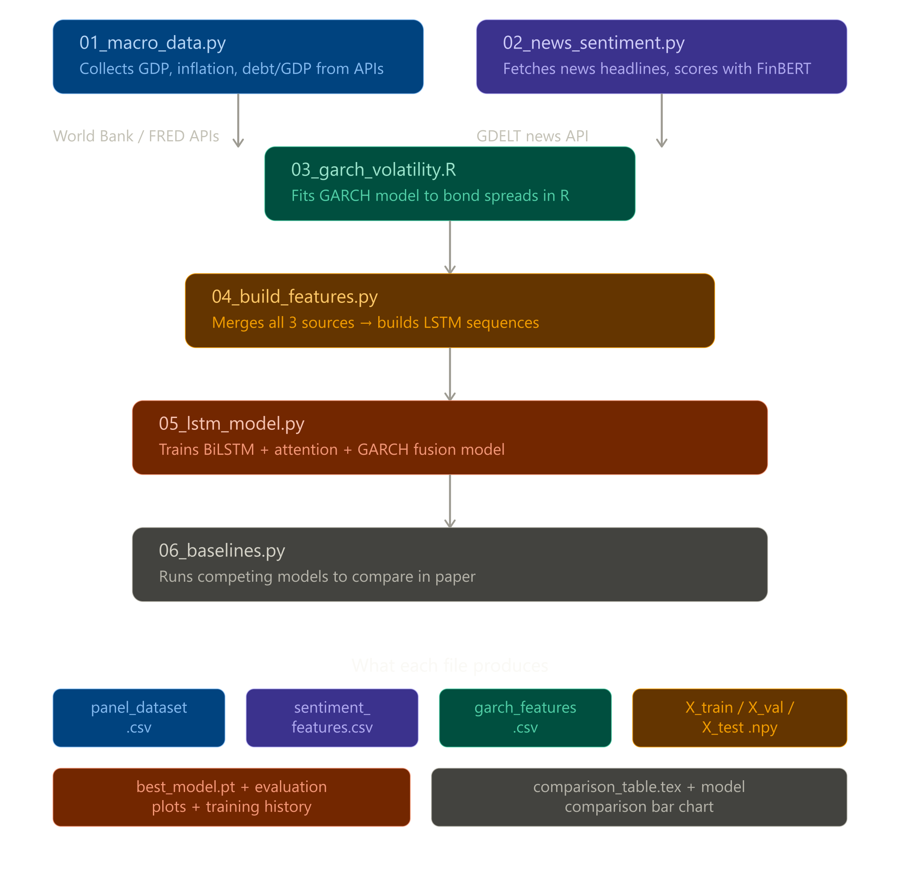
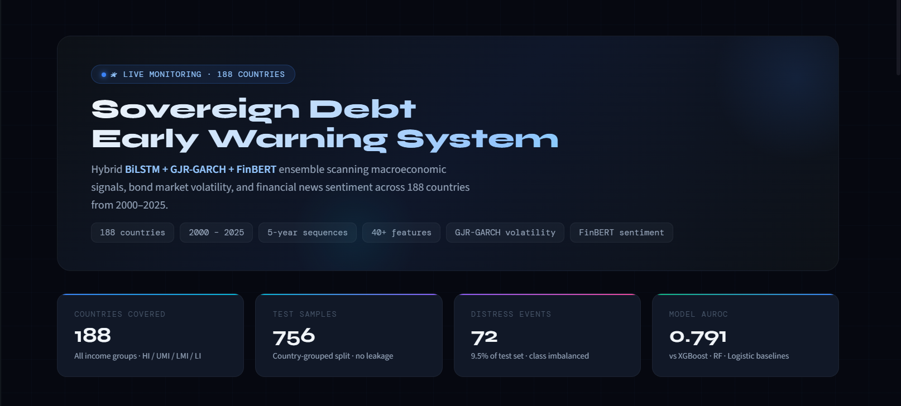
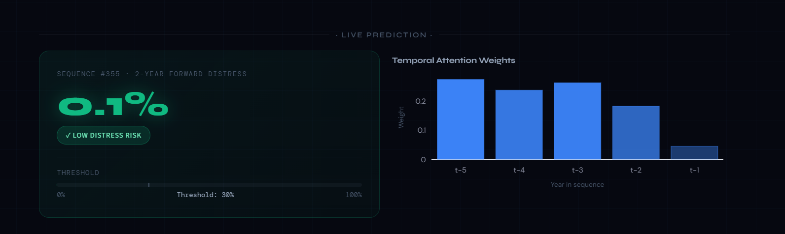
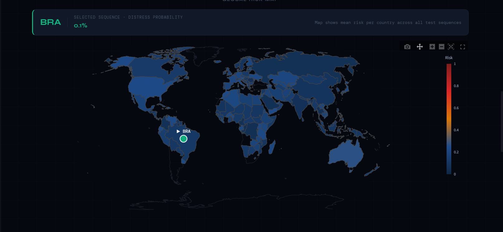
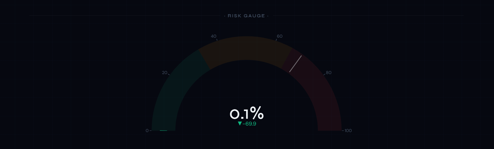
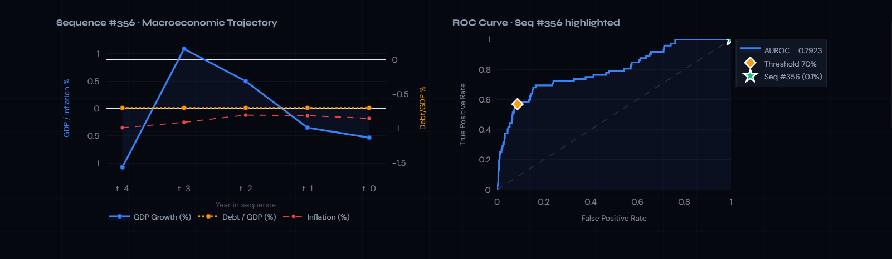

# 🌍 SovWatch
## Sovereign Debt Distress Early Warning System

SovWatch is a machine learning system designed to predict sovereign debt distress using macroeconomic indicators, financial volatility models, and financial news sentiment.

Dataset coverage:

• 188 countries  
• 2000–2025  
• ~4300 country-year observations  

---

## 🚀 Key Features

• Global sovereign distress prediction for 165 countries  
• Hybrid deep learning model combining macroeconomic indicators, GARCH volatility, and news sentiment  
• Interactive Streamlit dashboard for monitoring sovereign risk  
• Early-warning system for sovereign debt crises  

---

## 🏗 System Architecture



The system integrates three main signal sources:

1. **Macroeconomic indicators** (World Bank WDI + FRED)
2. **Financial volatility modeling** using GARCH
3. **Financial news sentiment** using FinBERT

These signals are combined using a **hybrid Bidirectional LSTM deep learning model**.

---

## 📊 Model Performance

| Model | AUROC | AUPRC | F1 |
|------|------|------|------|
| Hybrid BiLSTM (SovWatch) | 0.79 | 0.45 | 0.44 |
| XGBoost | 0.81 | 0.53 | 0.47 |
| Random Forest | 0.78 | 0.41 | 0.43 |
| Logistic Regression | 0.80 | 0.50 | 0.34 |

---

## 📊 Dashboard

### Overview

  


### Global Risk Map



### Distress Risk Gauge



### Model ROC Curve



---

## 📁 Project Structure

```
SovWatch
│
├── data_collection
│ ├── 01_macro_data.py
│ ├── 02_news_sentiment.py
│ ├── 03_garch_volatility.R
│ └── 04_build_features.py
│
├── models
│ ├── lstm_model.py
│ ├── 05_lstm_model.py
│ └── 06_baselines.py
│
├── images
│ ├── architecture.png
│ ├── dashboard.png
│ ├── dashboard1.png
│ ├── global_map.png
│ └── roc_curve.png
│
├── app.py
├── requirements.txt
└── README.md
```

---

## ⚙ Installation

Clone the repository
```
git clone https://github.com/Tarak-D/SovWatch.git
```
```
cd SovWatch
```

Install dependencies
```
pip install -r requirements.txt
```

---

## ▶ Run Dashboard
```
streamlit run app.py
```

---

## 🧠 Methodology

SovWatch combines three signal sources:

1. Macroeconomic indicators (World Bank WDI)
2. Financial volatility modeling (GJR-GARCH)
3. News sentiment analysis (FinBERT on GDELT headlines)

These features are converted into **5-year temporal sequences** and modeled using a **Bidirectional LSTM neural network**.

Training outputs include:
models/training_history.png
models/evaluation_plots.png


---

## 📄 Abstract

SovWatch is a machine learning system designed to provide early warnings of sovereign debt distress. By integrating macroeconomic indicators, financial volatility measures, and news sentiment signals, the system predicts crisis probabilities across 165 countries using a hybrid BiLSTM model.

---

## 🔬 Research Motivation

Sovereign debt crises can cause severe economic disruption.

Traditional early-warning systems rely mostly on macroeconomic indicators.

SovWatch improves prediction by combining:

• macroeconomic fundamentals  
• financial volatility signals  
• financial news sentiment  
• deep learning sequence models  

---

## 📊 Project Stats


---

## 👨‍💻 Author

**Tarak D**

[](https://github.com/Tarak-D)

[](https://www.linkedin.com/in/tarak-d-019392351)

---

## 💬 Support and Feedback

1. Found a bug? Open an issue
2. Have an idea? Start a discussion
3. Like the project? ⭐ Star the repository
4. Need help? Reach out via GitHub or LinkedIn

---

## 🌍 Impact Goals

### Economic Impact

• Improve early detection of sovereign debt crises  
• Support policymakers with AI-driven risk monitoring  
• Provide transparent sovereign risk analytics  

### Research Impact

• Demonstrate hybrid deep learning models for macroeconomic forecasting  
• Combine macro + volatility + sentiment signals  
• Enable reproducible sovereign risk prediction research  

---

## 🔮 Future Improvements

Potential extensions:

• transformer-based sequence models  
• explainability using SHAP values  
• real-time macroeconomic updates  
• global risk monitoring dashboards  